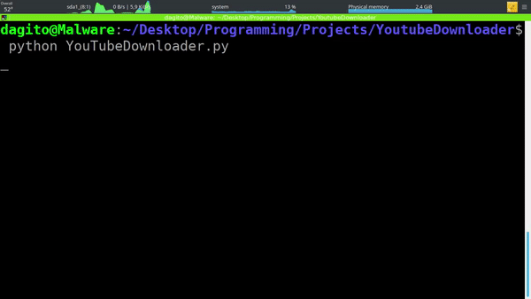
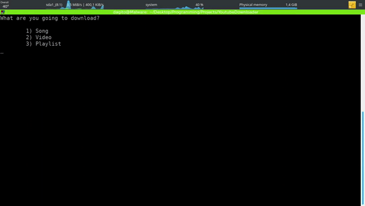
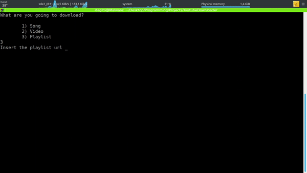
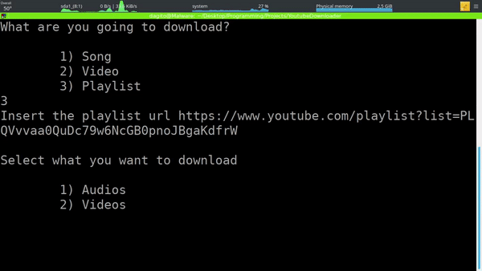

# YouTube Downloader

## Installation

Execute ```git clone https://github.com/Jodagito/YoutubeDownloader``` on the destination folder.

## Requirements
    pytube3==9.5.13
    requests==2.22.0

## Usage

Execute ```python YouTubeDownloader.py```

Destination path to save the downloaded files will be asked.



You will be asked to select what are you going to download, either a song, a video or an entire playlist.



An object URL must be inserted, if you chosed to download a playlist then you'll be asked to select what to download, wether only audios or full videos.



Finally your download will start and stop once everything have been downloaded.



## To Do

- Allow to download all videos from a specific channel.
- Allow users to select both audio and video quality.
- Allow users to pass an URL on file call.
- Automate playlists detection.
- Clean code.
- Create a progress bar.
- Develop tests.
- Validations.

